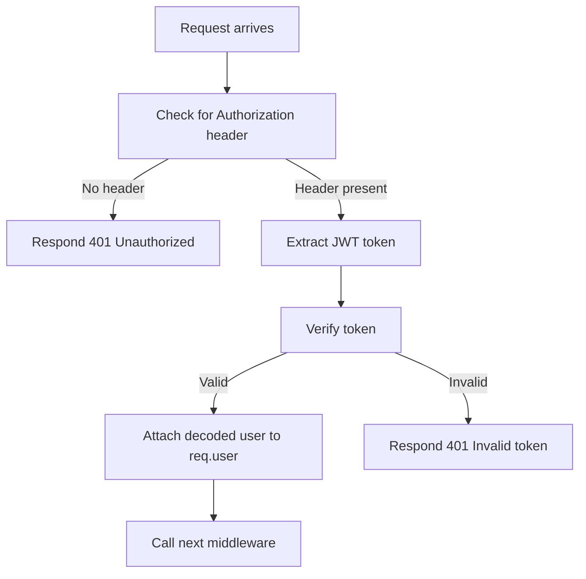
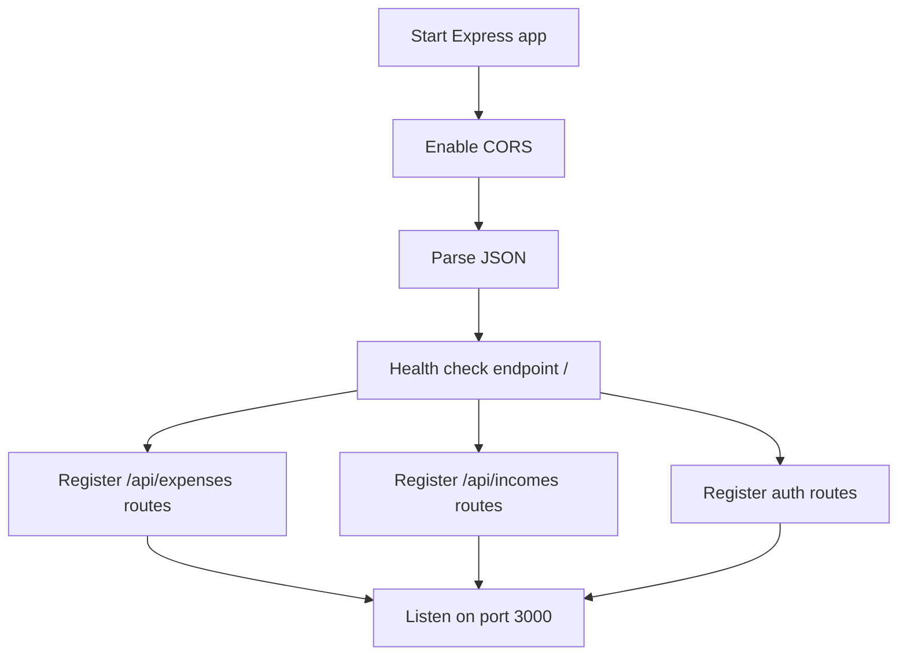
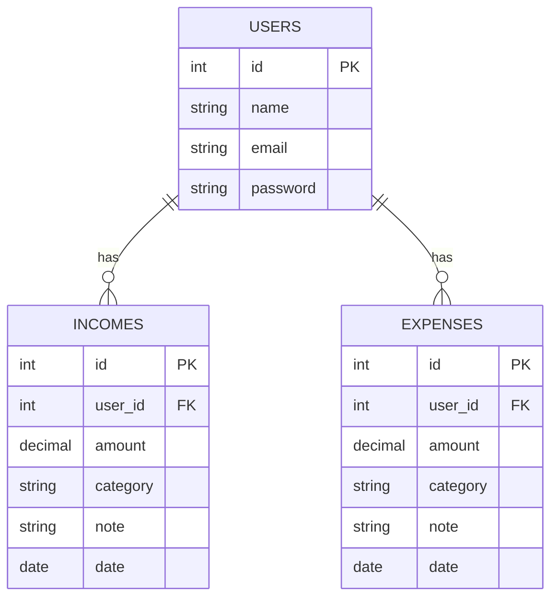

# Family Budget Backend Documentation

This documentation details the structure, purpose, and usage of the main files in your backend application. The project is a RESTful API server for managing users, incomes, and expenses, supporting authentication via JWT and CRUD operations on financial records.

---

## `incomesController.js`

Handles all business logic for **income-related** operations in the application.

### Responsibilities

- Create new income records for a user
- Fetch all incomes or filter by user
- Update existing income records

### Key Functions

| Function             | Purpose                                               |
|----------------------|-------------------------------------------------------|
| `createIncome`       | Add new income for a user                             |
| `getAllIncomes`      | Retrieve all incomes (admin use)                      |
| `getIncomesByUser`   | Retrieve all incomes for the current user (sorted)    |
| `updateIncome`       | Update an income record by ID                         |

### Database Interactions

All functions use parameterized SQL queries to interact securely with the database.

---

### API Endpoints

#### Create Income - POST `/api/incomes/`

```api
{
    "title": "Create Income",
    "description": "Create a new income record for the authenticated user.",
    "method": "POST",
    "baseUrl": "http://localhost:3000",
    "endpoint": "/api/incomes/",
    "headers": [
        {
            "key": "Authorization",
            "value": "Bearer <token>",
            "required": true
        }
    ],
    "bodyType": "json",
    "requestBody": "{\n  \"amount\": 500.00,\n  \"category\": \"Salary\",\n  \"note\": \"June salary\",\n  \"date\": \"2024-06-01\"\n}",
    "responses": {
        "201": {
            "description": "Income created",
            "body": "{\n  \"id\": 1,\n  \"user_id\": 2,\n  \"amount\": 500.00,\n  \"category\": \"Salary\",\n  \"note\": \"June salary\",\n  \"date\": \"2024-06-01\"\n}"
        },
        "500": {
            "description": "Server error during adding income",
            "body": "{\n  \"error\": \"Server error during adding income\" \n}"
        }
    }
}
```

#### Get All Incomes - GET `/api/incomes/`

```api
{
    "title": "Get All Incomes",
    "description": "Retrieve all income records (admin use or debugging).",
    "method": "GET",
    "baseUrl": "http://localhost:3000",
    "endpoint": "/api/incomes/",
    "headers": [],
    "bodyType": "none",
    "responses": {
        "200": {
            "description": "List of all incomes",
            "body": "[\n  { \"id\": 1, \"user_id\": 2, \"amount\": 500.00, \"category\": \"Salary\", \"note\": \"June salary\", \"date\": \"2024-06-01\" }\n]"
        }
    }
}
```

#### Get Incomes by User - GET `/api/incomes/:id`

```api
{
    "title": "Get Incomes by User",
    "description": "Retrieve all income records for a specified user, ordered by date descending.",
    "method": "GET",
    "baseUrl": "http://localhost:3000",
    "endpoint": "/api/incomes/:id",
    "pathParams": [
        {
            "key": "id",
            "value": "User ID",
            "required": true
        }
    ],
    "bodyType": "none",
    "responses": {
        "200": {
            "description": "List of user's incomes",
            "body": "[\n  { \"id\": 1, \"user_id\": 2, \"amount\": 500.00, \"category\": \"Salary\", \"note\": \"June salary\", \"date\": \"2024-06-01\" }\n]"
        },
        "500": {
            "description": "Server error",
            "body": "{ \"error\": \"Server error while fetching user incomes\" }"
        }
    }
}
```

#### Update Income - PUT `/api/incomes/:id`

```api
{
    "title": "Update Income",
    "description": "Update an existing income record by its ID.",
    "method": "PUT",
    "baseUrl": "http://localhost:3000",
    "endpoint": "/api/incomes/:id",
    "headers": [
        {
            "key": "Authorization",
            "value": "Bearer <token>",
            "required": true
        }
    ],
    "pathParams": [
        {
            "key": "id",
            "value": "Income record ID",
            "required": true
        }
    ],
    "bodyType": "json",
    "requestBody": "{\n  \"amount\": 600.00,\n  \"category\": \"Bonus\",\n  \"note\": \"Yearly bonus\",\n  \"date\": \"2024-06-15\"\n}",
    "responses": {
        "200": {
            "description": "Updated income record",
            "body": "{ \"id\": 1, \"user_id\": 2, \"amount\": 600.00, \"category\": \"Bonus\", \"note\": \"Yearly bonus\", \"date\": \"2024-06-15\" }"
        },
        "404": {
            "description": "Income not found",
            "body": "{ \"error\": \"Income not found\" }"
        }
    }
}
```

---

## `expensesController.js`

Handles **expense-related** business logic.

### Responsibilities

- Create new expenses for a user
- Retrieve all expenses or by user
- Update an existing expense

### Key Functions

| Function               | Purpose                                             |
|------------------------|-----------------------------------------------------|
| `createExpense`        | Add new expense for a user                          |
| `getAllExpenses`       | Retrieve all expenses (admin use)                   |
| `getExpensesByUser`    | Retrieve all expenses for the current user (sorted) |
| `updateExpense`        | Update an expense record by ID                      |

---

### API Endpoints

#### Create Expense - POST `/api/expenses/`

```api
{
    "title": "Create Expense",
    "description": "Add a new expense for the authenticated user.",
    "method": "POST",
    "baseUrl": "http://localhost:3000",
    "endpoint": "/api/expenses/",
    "headers": [
        {
            "key": "Authorization",
            "value": "Bearer <token>",
            "required": true
        }
    ],
    "bodyType": "json",
    "requestBody": "{\n  \"amount\": 120.00,\n  \"category\": \"Groceries\",\n  \"note\": \"Weekly groceries\",\n  \"date\": \"2024-06-10\"\n}",
    "responses": {
        "201": {
            "description": "Expense created",
            "body": "{ \"id\": 1, \"user_id\": 2, \"amount\": 120.00, \"category\": \"Groceries\", \"note\": \"Weekly groceries\", \"date\": \"2024-06-10\" }"
        },
        "500": {
            "description": "Server error during adding expense",
            "body": "{ \"error\": \"Server error during adding expense\" }"
        }
    }
}
```

#### Get All Expenses - GET `/api/expenses/`

```api
{
    "title": "Get All Expenses",
    "description": "Retrieve all expense records (admin use or debugging).",
    "method": "GET",
    "baseUrl": "http://localhost:3000",
    "endpoint": "/api/expenses/",
    "headers": [],
    "bodyType": "none",
    "responses": {
        "200": {
            "description": "List of all expenses",
            "body": "[ { \"id\": 1, \"user_id\": 2, \"amount\": 120.00, \"category\": \"Groceries\", \"note\": \"Weekly groceries\", \"date\": \"2024-06-10\" } ]"
        }
    }
}
```

#### Get Expenses by User - GET `/api/expenses/:id`

```api
{
    "title": "Get Expenses by User",
    "description": "Retrieve all expense records for a specified user, ordered by date descending.",
    "method": "GET",
    "baseUrl": "http://localhost:3000",
    "endpoint": "/api/expenses/:id",
    "pathParams": [
        {
            "key": "id",
            "value": "User ID",
            "required": true
        }
    ],
    "bodyType": "none",
    "responses": {
        "200": {
            "description": "List of user's expenses",
            "body": "[ { \"id\": 1, \"user_id\": 2, \"amount\": 120.00, \"category\": \"Groceries\", \"note\": \"Weekly groceries\", \"date\": \"2024-06-10\" } ]"
        },
        "500": {
            "description": "Server error",
            "body": "{ \"error\": \"Server error while fetching user expenses\" }"
        }
    }
}
```

#### Update Expense - PUT `/api/expenses/:id`

```api
{
    "title": "Update Expense",
    "description": "Update an existing expense record by its ID.",
    "method": "PUT",
    "baseUrl": "http://localhost:3000",
    "endpoint": "/api/expenses/:id",
    "headers": [
        {
            "key": "Authorization",
            "value": "Bearer <token>",
            "required": true
        }
    ],
    "pathParams": [
        {
            "key": "id",
            "value": "Expense record ID",
            "required": true
        }
    ],
    "bodyType": "json",
    "requestBody": "{\n  \"amount\": 150.00,\n  \"category\": \"Utilities\",\n  \"note\": \"Electricity bill\",\n  \"date\": \"2024-06-15\"\n}",
    "responses": {
        "200": {
            "description": "Updated expense record",
            "body": "{ \"id\": 1, \"user_id\": 2, \"amount\": 150.00, \"category\": \"Utilities\", \"note\": \"Electricity bill\", \"date\": \"2024-06-15\" }"
        },
        "404": {
            "description": "Expense not found",
            "body": "{ \"error\": \"Expense not found\" }"
        }
    }
}
```

---

## `authMiddleware.js`

Handles **JWT authentication** for protected routes.

### Responsibilities

- Extract JWT token from the `Authorization` header
- Verify token using the secret from environment variables
- Attach decoded user information to the request object for downstream use
- Block access for invalid or missing tokens

### Middleware Flow



### Error Handling

- Throws if JWT secret is missing
- Returns 401 for missing or invalid tokens

---

## `expenses.js`

Defines the **expenses API routes**.

### Route Table

| HTTP Method | Path            | Middleware     | Controller                       | Purpose                       |
|-------------|-----------------|---------------|----------------------------------|-------------------------------|
| POST        | `/`             | `auth`        | `createExpense`                  | Create new expense            |
| GET         | `/`             | `auth`        | *(empty handler)*                | Placeholder, does nothing     |
| GET         | `/`             | none          | `getAllExpenses`                 | Get all expenses              |
| GET         | `/:id`          | none          | `getExpensesByUser`              | Get expenses by user ID       |
| PUT         | `/:id`          | none          | `updateExpense`                  | Update expense by ID          |

#### Note

- The route definition is ambiguous: two GET `/` routes exist, which may cause routing issues. Only the first defined will execute if matched.

---

## `incomes.js`

Defines the **incomes API routes**.

### Route Table

| HTTP Method | Path            | Middleware     | Controller                       | Purpose                       |
|-------------|-----------------|---------------|----------------------------------|-------------------------------|
| POST        | `/`             | `auth`        | `createIncome`                   | Create new income             |
| GET         | `/`             | `auth`        | *(empty handler)*                | Placeholder, does nothing     |
| GET         | `/`             | none          | `getAllIncomes`                  | Get all incomes               |
| GET         | `/:id`          | none          | `getIncomesByUser`               | Get incomes by user ID        |
| PUT         | `/:id`          | `auth`        | `updateIncome`                   | Update income by ID           |

#### Note

- As with `expenses.js`, two GET `/` routes are defined, which may cause one to be unreachable.

---

## `auth.js`

Handles **user authentication**: registration and login.

### Responsibilities

- Register new users with hashed passwords
- Authenticate users, issuing JWT tokens on success

### API Endpoints

#### User Registration - POST `/register`

```api
{
    "title": "User Registration",
    "description": "Register a new user. Password will be securely hashed.",
    "method": "POST",
    "baseUrl": "http://localhost:3000",
    "endpoint": "/register",
    "bodyType": "json",
    "requestBody": "{\n  \"name\": \"Alice\",\n  \"email\": \"alice@example.com\",\n  \"password\": \"securepass\"\n}",
    "responses": {
        "201": {
            "description": "User created",
            "body": "{ \"id\": 2, \"name\": \"Alice\", \"email\": \"alice@example.com\" }"
        },
        "400": {
            "description": "User already exists",
            "body": "{ \"error\": \"User already exists\" }"
        },
        "500": {
            "description": "Server error",
            "body": "{ \"error\": \"Server error during registration\" }"
        }
    }
}
```

#### User Login - POST `/login`

```api
{
    "title": "User Login",
    "description": "Authenticate a user and receive a JWT token.",
    "method": "POST",
    "baseUrl": "http://localhost:3000",
    "endpoint": "/login",
    "bodyType": "json",
    "requestBody": "{\n  \"email\": \"alice@example.com\",\n  \"password\": \"securepass\"\n}",
    "responses": {
        "200": {
            "description": "Login success",
            "body": "{ \"token\": \"<JWT token>\" }"
        },
        "400": {
            "description": "Invalid credentials",
            "body": "{ \"error\": \"Invalid email or password\" }"
        },
        "500": {
            "description": "Server error",
            "body": "{ \"error\": \"Server error during login\" }"
        }
    }
}
```

---

## `index.js`

Entrypoint for the application server.

### Responsibilities

- Initialize Express application
- Enable CORS for frontend origin
- Parse incoming JSON requests
- Register all primary routes
- Serve a health check endpoint at `/`
- Start listening on port 3000

### Main Application Flow



---

### Health Check Endpoint

#### GET `/`

```api
{
    "title": "Health Check",
    "description": "Returns service status, name, and version.",
    "method": "GET",
    "baseUrl": "http://localhost:3000",
    "endpoint": "/",
    "bodyType": "none",
    "responses": {
        "200": {
            "description": "Service is running",
            "body": "{ \"status\": \"ok\", \"service\": \"Family Budget Backend\", \"version\": \"1.0.0\" }"
        }
    }
}
```

---

## Entity Relationship Diagram

Below is a simplified diagram of the main data relationships for users, incomes, and expenses.



---

```card
{
    "title": "Security Best Practice",
    "content": "Always keep your JWT_SECRET safe and never commit it to version control. Use environment variables in production."
}
```

---

# Summary

This backend serves as the foundation for a family budget management application, offering secure authentication and robust APIs for income and expense tracking. Use the interactive API blocks above to integrate or test endpoints. Review the entity relationships and be mindful of duplicate route definitions which may need refactoring for optimal clarity and safety.